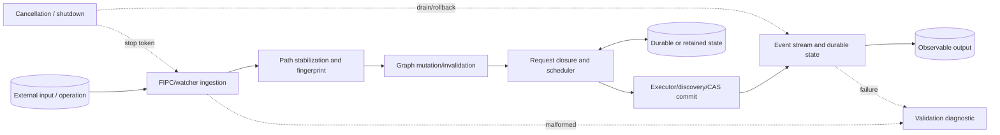
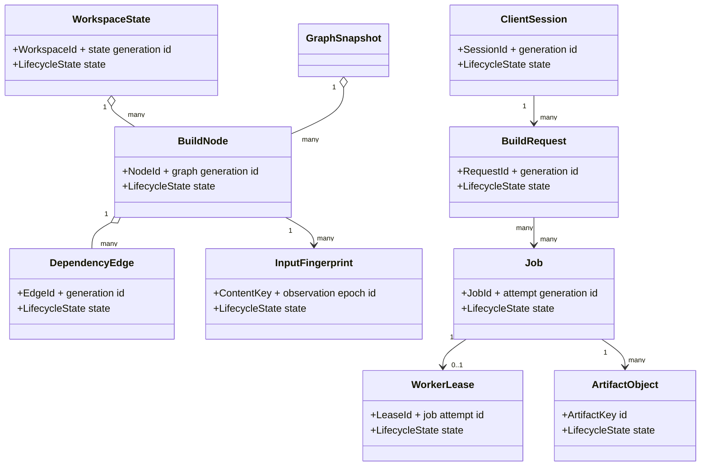
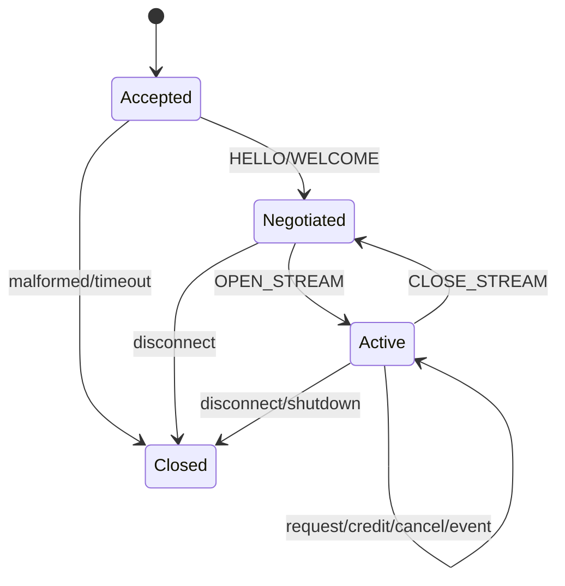
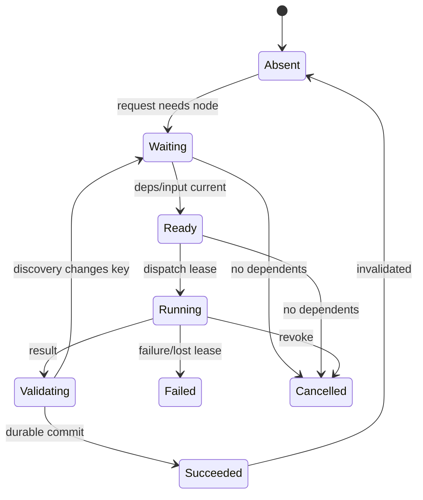
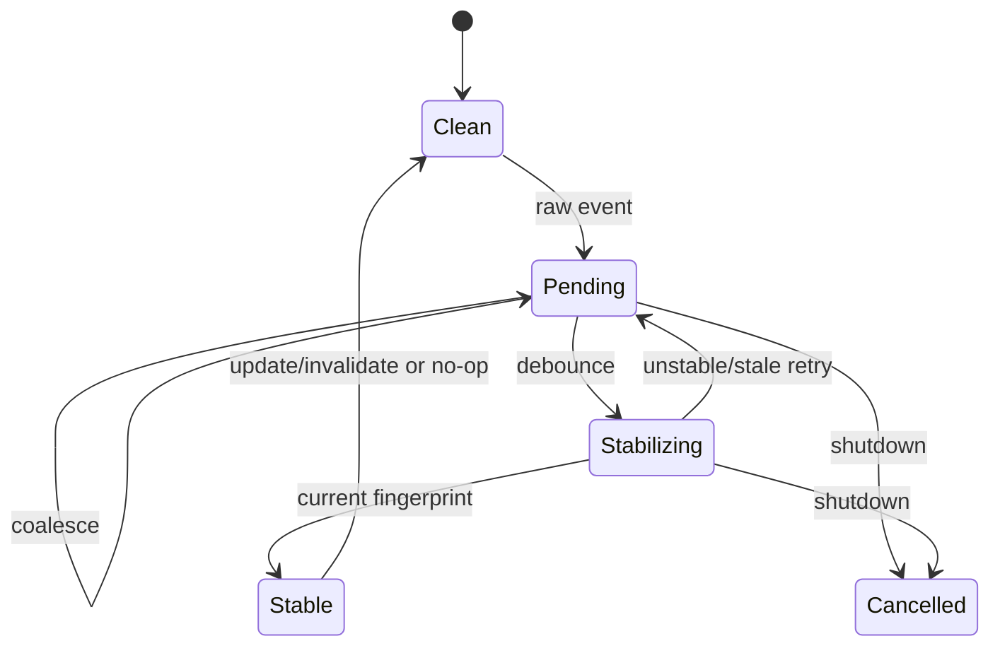

# 1. Project Identity

| Item | Specification |
| --- | --- |
| Name | Forge — Crash-Safe Incremental Build Graph Daemon |
| Description | A C++20 local daemon and embeddable core that tracks build dependencies, coalesces file events, invalidates generations, schedules duplicate-suppressed work, stores content-addressed artifacts, and communicates over an original local IPC protocol. |
| Language | C++20 |
| Platforms | Linux x86-64 and AArch64 using Unix-domain sockets and inotify-compatible adapter; portable filesystem/IPC watcher adapters are stretch goals |
| Source size | MVP 10,000–14,000 lines; full 30,000–43,000 lines |
| Test size | 14,000–20,000 lines |
| License | Proprietary internal license with third-party notices |

**Substantial because:** Forge coordinates a persistent dependency graph, discovered edges, filesystem event normalization, generation-based invalidation, content-addressed artifacts, worker leases, cancellation, cycle diagnostics, custom IPC, crash replay, and deterministic scheduling.

# 2. Product Definition

**Problem/users:** Local tools need a reliable way to keep a build graph warm across client invocations, avoid duplicate work, react to noisy filesystem events, and recover after interruption without trusting stale artifacts. Users: compiler-toolchain teams, asset-pipeline developers, monorepo tooling authors, IDE integration teams, and local automation products

| Use case | Input | Result |
| --- | --- | --- |
| Interactive rebuild | Changed source paths and a requested target set | Only transitively invalid nodes run; clients receive ordered status and artifact results. |
| Dependency discovery | A worker result containing normalized discovered inputs | The graph updates atomically, affected nodes are re-evaluated, and cycles/staleness are reported. |
| Daemon restart | Persisted graph/event log/artifact store after a simulated crash | Forge replays complete transactions, reconciles leases, and never claims an incomplete result is valid. |

- **Inputs:** FIPC-1 local protocol messages, declarative node/edge mutations, normalized filesystem events, build requests, worker start/progress/result events, content bytes/digests, cancellation and daemon lifecycle events
- **Outputs:** build result streams, artifact handles, graph/query diagnostics, status events, invalidation explanations, persisted checkpoints/logs, and deterministic scheduler traces
- **Observable behavior:** one logical job per node/generation/action key, stable invalidation explanations, bounded queues/backpressure, no arbitrary command execution in fuzzing.
- **MVP:** single workspace; static plus discovered dependencies; content fingerprints; file-event debounce/coalescing; one daemon event loop; bounded mock or subprocess executor abstraction; duplicate work suppression; cancellation; artifact CAS; custom IPC; append log/checkpoint/restart; three fuzz targets
- **Full version:** multiple workspaces, worker pool and resource classes, dynamic dependency stabilization, remote-compatible executor interface without remote service dependency, watcher adapters, artifact garbage collection, graph snapshots, priority/fairness, speculative cache lookup, richer status subscriptions, and online state compaction
- **Non-goals:** copying Ninja/Bazel/Make semantics or file formats, distributed scheduling, sandbox implementation, shell-language parsing, package management, cloud artifact service, arbitrary untrusted shell execution inside fuzz harnesses, or using filesystem mtimes as the sole correctness key
- **Originality:** Forge separates `GraphGeneration` (structural dependencies), `InputEpoch` (observed content state), and `BuildGeneration` (one request closure).
- **Project-specific coverage:** The daemon explicitly covers versioned build nodes and dependency edges; dependency discovery; content-addressed artifacts; incremental invalidation; worker scheduling; file-event coalescing; custom local IPC; crash-safe state; cancellation, duplicate-work suppression, and cycle handling; and daemon-restart sequence fuzzing with a deterministic mock executor rather than untrusted shell commands.

# 3. Engineering Difficulty Profile

| Source | Why difficult | Invariant consequence |
| --- | --- | --- |
| Cross-domain event flow | Filesystem event → content stabilization → node invalidation → graph closure → scheduler admission → executor result → discovery update → CAS publication. | A late event or discovery result can invalidate work that is already queued or running. |
| Stateful generations | Graph, input, request, node dirty state, job attempt, and daemon persistence generations overlap. | Every result and callback must prove it belongs to the current node/request generation before publication. |
| Dependency cycles and discovery | Edges may be added after execution and can create cycles or change the action key. | The daemon needs deterministic SCC diagnostics and bounded rebuild stabilization rather than recursion or silent acceptance. |
| Ownership and cancellation | Clients, subscriptions, build requests, jobs, worker leases, artifact streams, watchers, and persisted records have different lifetimes. | Disconnect/cancel/restart cannot leak work or publish a result to a dead/stale request. |
| Crash safety | A crash may occur between artifact write, discovery record, node result, request completion, checkpoint, or file rename. | Only committed log transactions and digest-verified CAS objects are authoritative. |
| Backpressure and fairness | Noisy watchers and slow clients can outpace hashing, scheduler, worker, and event streams. | Each queue needs explicit credit/coalescing/drop semantics without losing correctness events. |

**Cross-phase validation:** A path is normalized and workspace-confined, then stabilized and fingerprinted; that value participates in invalidation, action-key derivation, scheduler duplicate suppression, artifact metadata, persistence replay, and final client explanations, with generation checks at each handoff. Shallow framing-only or stateless implementations are incorrect.

# 4. System Architecture



- **Processes/threads:** The MVP has one daemon event loop that owns mutable graph/request/job state, a bounded hashing pool, and a bounded executor pool.
- **Normal path:** authenticate/initialize a local client session, parse a build request, stabilize pending file events, compute dirty closure and action keys, attach the request to existing equivalent jobs or enqueue new jobs.
- **Malformed path:** FIPC framing/state errors close only the offending session after a bounded diagnostic; invalid graph mutations or escaping paths abort their transaction.
- **Cancel/shutdown:** stop accepting sessions/requests, freeze watcher intake with an explicit final coalescing barrier, cancel or checkpoint requests by policy, revoke executor leases.
- **Recovery:** acquire the workspace lock, validate checkpoint and append log records, replay only complete state transactions, verify referenced CAS objects, convert running/leased attempts to `Lost`

| Module | Responsibility | Input | Output | Owns | Invariant | Dependencies |
| --- | --- | --- | --- | --- | --- | --- |
| Daemon | Owns lifecycle, event loop, workspace registry, queues, and publication. | IPC/watcher/worker events | State transitions/client events | Socket, loop, stop source | All mutable workspace state changes on its owning loop. | IpcServer, Workspace |
| IpcServer | Decodes FIPC sessions, negotiation, credits, and requests. | Local socket bytes | Typed client events/encoded responses | Connections, input/output buffers | A message is dispatched only in a legal negotiated session state. | FipcCodec, AuthPolicy |
| Workspace | Coordinates graph, content state, requests, scheduler, persistence. | Normalized operations/events | Workspace snapshots/results | GraphStore, request/job tables | GraphGeneration and InputEpoch are monotonic and publication is atomic. | BuildGraph, StateStore |
| BuildGraph | Stores nodes, declared/discovered edges, reverse edges, and SCC metadata. | Graph mutations/discovery updates | Node/edge handles/closures | Generation arenas/indexes | Forward and reverse edge sets agree; handles are generation-safe. | CycleAnalyzer |
| Fingerprinter | Reads stable file metadata/content and computes content keys. | Workspace path/stabilization token | InputFingerprint | FDs, read buffers | Result publishes only if token still current and read is internally consistent. | HashPool, VirtualFS adapter |
| InvalidationEngine | Propagates input/graph changes with explanations. | Changed nodes/edges/content | Dirty generations/reasons | Traversal queues/reason DAG | A node is clean only if every action-key input matches its last success. | BuildGraph |
| ExecutorManager | Owns worker slots and invokes executor abstraction. | JobSpec/lease/cancel | Progress/result/discovery events | Worker threads/process handles | Only the current lease can complete an attempt. | Executor, ArtifactStore |
| ArtifactStore | Stores and verifies immutable content-addressed outputs. | Artifact streams/digests/metadata | ArtifactHandle | Temp files, CAS objects, leases | Published key equals digest of canonical bytes/metadata and object is durable. | StateStore |
| CycleAnalyzer | Maintains or recomputes SCCs and deterministic cycle witnesses. | Graph generations/edge changes | SCC labels/diagnostics | Work arrays/cache | A scheduled node is not in a prohibited unresolved SCC. | BuildGraph |
| EventHub | Fans out status/result events under per-stream credit. | Normalized daemon events | Client frames/subscription snapshots | Event batches/subscribers | Droppable progress is distinguished from required terminal/state events. | IpcServer |

# 5. Proposed Repository Layout

```text
    forge/
    ├── CMakeLists.txt
    ├── cmake/{Warnings.cmake,Sanitizers.cmake,FuzzTargets.cmake}
    ├── include/forge/{client.hpp,daemon.hpp,graph.hpp,executor.hpp,artifact.hpp,error.hpp}
    ├── src/base/{checked.cpp,id.cpp,arena.cpp,virtual_clock.cpp}
    ├── src/ipc/{fipc_codec.cpp,session.cpp,server.cpp,client.cpp}
    ├── src/workspace/{workspace.cpp,path_policy.cpp,file_coalescer.cpp,fingerprint.cpp}
    ├── src/graph/{build_graph.cpp,invalidation.cpp,cycle_analyzer.cpp,snapshot.cpp}
    ├── src/schedule/{scheduler.cpp,request.cpp,job.cpp,resource_pool.cpp}
    ├── src/execute/{executor_manager.cpp,subprocess_executor.cpp,mock_executor.cpp,discovery.cpp}
    ├── src/artifact/{cas.cpp,artifact_writer.cpp,gc.cpp}
    ├── src/state/{state_codec.cpp,append_log.cpp,checkpoint.cpp,recovery.cpp,compact.cpp}
    ├── src/event/{event_hub.cpp,explanation.cpp}
    ├── src/cli/{forged_main.cpp,forge_main.cpp,cmd_build.cpp,cmd_graph.cpp,cmd_status.cpp}
    ├── tests/unit/{fipc_tests.cpp,graph_tests.cpp,coalescer_tests.cpp,scheduler_tests.cpp}
    ├── tests/integration/{build_flow.cpp,discovery.cpp,cancellation.cpp,restart.cpp,backpressure.cpp}
    ├── fuzz/{fuzz_fipc_decoder.cpp,fuzz_daemon_events.cpp,fuzz_build_pipeline.cpp}
    ├── tools/{forge_state_dump.cpp,forge_trace_replay.cpp,forge_fixture.cpp}
    ├── examples/{embedded_mock.cpp,client_stream.cpp}
    ├── docs/{ARCHITECTURE.md,FIPC_PROTOCOL.md,STATE_FORMAT.md,RECOVERY.md}
    ├── corpus/{fipc,event_sequences,pipelines}/
    └── scripts/{run_fuzz.sh,crash_matrix.py,benchmark.py,soak.py}
```

| Important file | Purpose |
| --- | --- |
| `include/forge/executor.hpp` | Narrow executor lease/result/discovery API; fuzzers bind the deterministic mock. |
| `src/ipc/fipc_codec.cpp` | Only production FIPC framing parser for daemon, client, and fuzzers. |
| `src/graph/invalidation.cpp` | Generation/reason propagation and clean-state proof. |
| `src/schedule/scheduler.cpp` | Ready selection, action-key duplicate suppression, priority and cancellation. |
| `src/state/recovery.cpp` | Checkpoint/log/CAS replay and lost-attempt reconciliation. |
| `docs/STATE_FORMAT.md` | Normative committed state and crash boundary rules. |

Tests and fuzzers link production libraries; no duplicate decoder/state logic.

# 6. Core Data Model

| Entity | Role | Ownership | Mutability | Stable ID | Thread safety |
| --- | --- | --- | --- | --- | --- |
| WorkspaceState | Current graph/input/request/job generation roots | Owned by Workspace loop | Mutable through atomic events | WorkspaceId + state generation | Loop-confined |
| BuildNode | Declared action, options, inputs, outputs, last success | Owned by graph generation arena | Versioned copy-on-write | NodeId + graph generation | Snapshot-readable |
| DependencyEdge | Declared or discovered dependency with provenance | Owned by graph generation arena | Immutable per generation | EdgeId + generation | Snapshot-readable |
| InputFingerprint | Stable content/type/metadata identity | Value owned by input table | Immutable | ContentKey + observation epoch | Thread-safe value |
| BuildRequest | Targets, policy, clients, closure and terminal result | Owned by request table | Mutable until terminal | RequestId + generation | Loop-confined |
| WorkerLease | Authority for one executor attempt/completion | Owned by ExecutorManager then completion event | Move-only | LeaseId + job attempt | Transferable |
| ArtifactObject | Immutable CAS bytes and metadata | Owned by ArtifactStore/file; leased by handles | Immutable | ArtifactKey | Thread-safe |
| ClientSession | Negotiated FIPC streams/credits/idempotency map | Owned by IpcServer loop | Mutable until closed | SessionId + generation | Loop-confined |
| GraphSnapshot | Immutable graph/input state for query/build closure | Shared immutable owner | Immutable | GraphGeneration + InputEpoch | Thread-safe |



**Lifecycles/serialization:** Graph mutations create a new immutable GraphGeneration and publish atomically. Invalid/transitional states are explicit; cache-only fields never serialize.

# 7. Custom Format or Protocol Specification

## FIPC-1 Forge local IPC and FST-1 state-log records

| Rule | Definition |
| --- | --- |
| Magic | `FIP1 (wire), FST1 (state file)` |
| Endian | little-endian fixed wire/state fields; path and string payloads are UTF-8 bytes under workspace normalization policy |
| Integers | u8/u16/u32/u64 fixed plus minimal unsigned LEB128 for repeated-field counts/lengths; signed zigzag for virtual-time deltas only |
| Alignment | FIPC frames are packed with no implicit alignment; FST headers are 64-byte aligned and records 8-byte aligned with zero padding |
| Versioning | wire negotiation exchanges major/minor and capability masks; state superblock uses required/optional features and per-record schema; unknown required semantics reject |
| Integrity | FIPC header CRC32C and optional payload CRC after negotiation; FST per-record CRC32C, transaction digest, checkpoint digest, and CAS content digest |
| Depth | nested protocol values 16, graph query/filter nesting 64, dependency traversal explicit with node/edge caps |
| Canonical | minimal varints, sorted map keys, normalized relative paths, stable node/edge/action-key field order, zero state padding, and deterministic set ordering |
| Unknown | unknown optional FIPC message on an extension stream receives UNSUPPORTED without closing; unknown required session/control message closes. |
| Truncation | partial FIPC frame returns NeedMore until peer EOF then closes session; partial FST tail or transaction is ignored on replay after a diagnostic |

### Header/footer and framing

| Field | Encoding | Constraint | Meaning |
| --- | --- | --- | --- |
| magic | 4 bytes | `FIP1` or `FST1` | Protocol/file discriminator. |
| major/minor | u16/u16 | major 1 | Compatibility. |
| header_bytes | u16 | 32..4096 | Extension boundary. |
| flags | u16 | Known or negotiated | Framing/integrity behavior. |
| session_or_workspace | 16 bytes | Zero only in initial HELLO | Namespace identity. |
| generation_or_sequence | u64 | Monotonic in context | Session/state ordering. |
| required/optional_caps | u64/u64 | Peer/replay checked | Feature semantics. |
| max_frame_or_record | u32 | Within hard limit | Allocation bound. |
| header_crc32c | u32 | Covers declared header | Integrity. |

FIPC frame: `{u32 frame_len,u16 type,u16 flags,u32 stream_id,u32 stream_generation,u64 sequence,u64 request_token,u32 header_crc,u32 payload_crc,payload}`; control stream is 0, stream IDs may be reused only with a greater generation, sequence is per stream, and CREDIT controls queued response bytes.

#### FIPC termination and FST-1 publication layout

FIPC-1 has no byte-stream footer. A stream ends through a terminal `STATUS_EVENT`, cancellation outcome, or session close frame; transport EOF without required terminal events is an abrupt-session result. Stream IDs are reusable only with an incremented generation.

FST-1 state validity is transaction-based:

| State element | Encoding | Constraint | Meaning |
| --- | --- | --- | --- |
| `STATE_TXN_BEGIN` | framed record with transaction ID, base state sequence, and declared count | Base equals the currently replayed state | Starts a private durable mutation group. |
| graph/input/job deltas | framed canonical records | Cross-record IDs and generations agree | Describe graph, filesystem, and scheduler changes. |
| `STATE_TXN_COMMIT` | transaction digest plus new state sequence | All declared records precede it and CAS references validate | Publishes the group during replay. |
| `CHECKPOINT` | complete graph/input/job roots, CAS reachability summary, state sequence, digest | Written to a new file and referenced by a committed log record | Bounds restart work and permits log rotation. |
| log EOF | no bytes | Bytes after the last complete committed group are ignored | Cannot publish partial jobs or graph mutations. |

Terminal build events are never dropped by event coalescing; they reserve IPC credit before encoding.

| Type | Code | Payload | Constraints | Semantics |
| --- | --- | --- | --- | --- |
| HELLO / WELCOME | 0x0001/0x0002 | Versions, capabilities, limits, client/workspace identity | First control exchange only | Negotiates FIPC session. |
| OPEN_STREAM / CREDIT | 0x0010/0x0011 | Stream ID/generation/kind and byte credit | Sequence/reuse rules valid | Creates flow-controlled request/event stream. |
| GRAPH_TXN | 0x0020 | Node/edge put/delete operations and expected generation | Paths/IDs/schema valid | Atomically mutates build graph. |
| BUILD_REQUEST | 0x0030 | Targets, priority, policy, idempotency token | Targets bounded; token stable | Starts or attaches to build request. |
| CANCEL_REQUEST | 0x0031 | Request ID/generation/reason | Session authorized | Detaches/cancels by policy. |
| STATUS_EVENT | 0x0040 | Event kind, IDs/generations, progress/result/explanation | Fits credit; terminal never droppable | Streams daemon observations. |
| WORKER_RESULT | 0x0050 | Lease, outcome, artifacts, discovered deps, diagnostics | Lease current; artifacts verified | Internal/test worker completion message. |
| STATE_TXN_BEGIN | 0x1000 | Txn ID/base state/count | Base current | Begins durable state update. |
| GRAPH_DELTA / INPUT_DELTA / JOB_DELTA | 0x1010..0x1012 | Canonical state changes | Cross-record invariants agree | Persists graph/input/job state. |
| STATE_TXN_COMMIT / CHECKPOINT | 0x10F0/0x10F1 | Digest/new state seq or complete snapshot roots | All references/CAS keys valid | Publishes/restarts durable state. |

### Examples and streaming behavior

- **Valid 1:** A client negotiates, opens a build stream with 64 KiB credit, sends BUILD_REQUEST token 44 for target `app`, and receives queued/running/succeeded STATUS_EVENT frames whose sequence increases and artifact key is digest-verified.
- **Valid 2:** FST transaction 18 records a changed input fingerprint, marks nodes 5 and 9 dirty, completes job 73 with discovered edge `9→12`, and commits state sequence 501; replay applies all records or none.

- **Malformed 1:** FIPC frame length is smaller than its header or exceeds negotiated maximum: close the session without dispatching payload.
- **Malformed 2:** BUILD_REQUEST reuses a request token with different target/options: return IDEMPOTENCY_CONFLICT and keep the original request unchanged.
- **Malformed 3:** WORKER_RESULT names a stale lease generation or artifact digest does not match bytes: reject/quarantine result and leave job non-successful.
- **Malformed 4:** STATE_TXN_COMMIT digest or declared count omits a GRAPH_DELTA: ignore the transaction during replay and retain the prior committed state.

- **Partial input:** FIPC decoding preserves incomplete fixed header/payload without advancing stream sequence. Output frames reserve credit before encoding and may be resumed after partial socket writes. FST replay streams records and large artifact metadata; CAS bytes live in separate files written temp→digest verify→fsync→atomic rename. Checkpoints are written to a new file and become authoritative only after log commit references the checkpoint digest.

# 8. State Machines and Lifecycle Rules

### Client session, stream, credit, and request lifecycle

**Scope:** FipcCodec, IpcServer, ClientSession, EventHub, Workspace request table, and disconnect/cancellation policy.

| From | Event | Guard | Action | To |
| --- | --- | --- | --- | --- |
| Accepted | HELLO | version/caps/limits/auth valid | select capabilities and send WELCOME | Negotiated |
| Negotiated | OPEN_STREAM | ID/generation unused and stream cap available | create sequence/credit state | Active |
| Active | BUILD_REQUEST | stream sequence/token/payload valid | create or idempotently attach request | Active |
| Active | CREDIT | nonoverflowing positive delta | increase send budget and flush queued frames | Active |
| Active | CANCEL_REQUEST | request generation/ownership valid | detach or trigger request cancellation policy | Active |
| Active | CLOSE_STREAM | sequence valid | detach subscriptions; terminalize stream generation | Negotiated |
| Accepted | malformed/timeout | always | emit bounded close if possible; release buffers | Closed |
| Active | disconnect/shutdown | always | detach session and apply orphan policies | Closed |



- **Illegal transitions:** dispatch before negotiation, reuse stream ID without higher generation, accept nonmonotonic sequence, send beyond credit, or let disconnect implicitly mark a build successful.
- **Cancellation:** request cancellation is idempotent and policy-driven; closing a stream drops droppable progress but required terminal state remains queryable/persisted.
- **Timeout:** negotiation and idle session use daemon monotonic time; deterministic tests inject virtual time.
- **Recovery:** client sessions are not persisted; idempotency tokens and request terminal records permit a reconnecting client to query or safely retry.
- **Transition invariants:** each live stream has one `(id,generation)`, expected receive sequence, nonnegative send credit, and bounded required-event backlog.

### Build request, node job, worker lease, discovery, and publication

**Scope:** BuildRequest, InvalidationEngine, Scheduler, ExecutorManager, ArtifactStore, discovery graph transaction, StateStore, and EventHub.

| From | Event | Guard | Action | To |
| --- | --- | --- | --- | --- |
| Absent | request closure needs node | snapshot/current dirty generation valid | compute action key; attach to active equivalent job or create | Waiting |
| Waiting | dependencies successful | all required inputs current and no prohibited cycle | reserve resources and enqueue ready key | Ready |
| Ready | dispatch | worker/resources available and attempt current | issue WorkerLease and persist attempt-start intent | Running |
| Running | worker result | lease current; result framing valid | verify outputs and normalize discovered deps | Validating |
| Validating | discovery/action key unchanged | artifacts durable and inputs still current | commit result, artifact refs and success atomically | Succeeded |
| Validating | discovery changes graph/key | bounded stabilization count | commit graph delta; invalidate result and create next generation | Waiting |
| Running | failure/lease loss | attempt current | record failure or retry decision | Failed |
| Waiting | cancel/no dependents | no request requires job | remove or cancel according to policy | Cancelled |
| Ready | cancel/no dependents | no request requires job | remove queue reservation | Cancelled |
| Running | cancel/no dependents | executor supports cancellation | revoke lease; ignore late completion | Cancelled |
| Succeeded | input/graph changes | action key proof no longer holds | mark new node generation dirty; keep old artifact immutable | Absent |



- **Illegal transitions:** two active jobs for same action key/generation, accepting a stale lease, publishing before CAS/state durability, declaring success before discovered deps stabilize, or cancelling work still required by another request.
- **Cancellation:** detach cancelling requests first; shared job stops only when no live dependent requests or policy explicitly permits.
- **Timeout:** queue, execution, idle-output, and total-attempt deadlines are executor/resource policies; timeout is a typed attempt failure and may retry with a new generation.
- **Recovery:** Running/Validating attempts replay as Lost unless an atomic committed success and verified CAS objects exist.
- **Transition invariants:** one current attempt per job; success records exact action key/input epochs/discovered graph generation/artifacts; every attached request observes one terminal node generation.

### Filesystem event coalescing, stabilization, and invalidation

**Scope:** Watcher adapter, FileEventCoalescer, virtual clock, Fingerprinter, input table, InvalidationEngine, and StateStore.

| From | Event | Guard | Action | To |
| --- | --- | --- | --- | --- |
| Clean | raw event | path normalizes inside workspace | increment path event generation and schedule debounce | Pending |
| Pending | more raw events | same normalized path | merge kind, increment generation, reschedule | Pending |
| Pending | debounce due | token current | issue stable-read/fingerprint task | Stabilizing |
| Stabilizing | read changed during sample | retry budget remains | increment sample attempt and reschedule | Pending |
| Stabilizing | fingerprint complete | event/sample token current | compare/update input epoch and persist change | Stable |
| Stable | fingerprint differs | state commit succeeds | propagate dirty reasons and wake scheduler | Clean |
| Stable | fingerprint equal | state commit/no-op recorded as policy | discard noisy event | Clean |
| Pending | cancel/shutdown | always | retain dirty-rescan marker when needed | Cancelled |
| Stabilizing | stale completion | token differs | discard result | Pending |



- **Illegal transitions:** publishing a stale hash result, treating rename/delete/create without path policy, invalidating before durable input update under crash-consistent mode, or dropping an event without rescan/no-op proof.
- **Cancellation:** shutdown records roots/path buckets requiring rescan; individual obsolete stabilization tasks simply discard by token.
- **Timeout:** stabilization uses virtual/monotonic deadline and retry cap; an unstable path remains explicitly dirty/unbuildable rather than guessed clean.
- **Recovery:** watcher queues are not trusted across restart; recovered input table is reconciled by root scan or recorded dirty roots before scheduling builds.
- **Transition invariants:** at most one current token per path; InputEpoch changes only when a committed fingerprint changes; dirty reasons reference the committed before/after fingerprints.

# 9. Memory Ownership and Resource Management

RAII is mandatory for file descriptors, mappings, heap buffers, locks, queue leases, plugin instances, and transactional scopes. `std::unique_ptr` is the default owner; `std::shared_ptr` is restricted to explicitly shared immutable snapshots or plugin code objects. Raw pointers and references are non-owning observers whose lifetime is bounded by a call or documented guard object.

| Concern | Rule |
| --- | --- |
| Allocation domains | FIPC connection buffers, graph generation arenas/indexes, watcher/coalescer path entries, fingerprint I/O buffers. |
| Transfer | decoded message value moves into loop event; scheduler moves JobSpec into WorkerLease. |
| Borrowing/slices | FIPC payload views are callback-scoped; BuildNode/Edge views borrow GraphSnapshot; JobSpec path/value views own shared immutable snapshot. |
| Shared ownership | immutable GraphSnapshot, ActionSpec, ArtifactObject and finalized status values may be shared; mutable Workspace/Request/Job/Session objects are unique to event loop |
| Arenas/pools | graph generations use immutable arenas; each graph/state transaction has rollback arena. |
| Handles | NodeId stable; graph/input/request/job/attempt/stream/worker handles include generations; ArtifactKey content-addressed; FIPC request token idempotency entries scoped to authenticated client/workspace |
| Iterator invalidation | graph snapshot iterators survive newer generations but not snapshot release; ready-queue iterators are internal and invalidated on mutation. |
| Reallocation | all completion/queue values use IDs/owned values; vectors reserve before index publication. |
| Plugins/callbacks | executors/watchers/fingerprinters are registered before daemon start. |
| Thread handoff | queues contain move-only messages with owned buffers, shared immutable snapshots, and stable IDs. |
| Eviction/snapshots | graph snapshots and artifacts are pin-counted. |
| Mappings/files | state checkpoint and optional artifact mappings are RAII leases; append log rotation retains old file until replay/snapshot readers release. |
| Unwinding | GraphTxn, StateTxn, ArtifactWriter, WorkerLease and publication guards roll back unless explicitly committed; user/client callbacks run without workspace mutation locks |
| Shutdown | Ipc acceptor/watchers → new requests → coalescer barrier → scheduler dispatch → worker leases → state/CAS commits → terminal event drain → pools/plugins → snapshots/mappings/log/socket lock |

Every retained observer is protected by an owner/lease and stable generation; raw addresses are never durable identities.

# 10. Core Algorithms

### 1. Incremental FIPC frame decode and session dispatch

**Purpose/I/O:** Parse arbitrary socket chunks while enforcing negotiation, stream generation, sequence, credit, and idempotency. Connection state plus bytes → typed loop events/responses and consumed count.  
**Preconditions:** Connection buffer/frame caps configured.  
**Procedure:** `accumulate fixed header → checked-validate frame length/type/stream IDs/CRCs → buffer bounded payload → look up legal session/stream state → verify expected sequence and negotiated capability → decode message fields with bounded cursor → stage idempotency/credit effect → dispatch typed event then commit sequence`  
**Complexity/failures:** O(frame bytes), bounded per connection.; truncation, overflow, CRC, illegal state/sequence, unsupported required type, allocation/backpressure.  
**Interactions/invariant:** IpcServer, EventHub, Workspace.; malformed frame causes no partial state effect; alternate socket splits produce identical events/diagnostics.

### 2. Filesystem event coalescing and stable fingerprint

**Purpose/I/O:** Convert noisy events into one current content observation per normalized path. Raw events and virtual time → committed InputFingerprint change or explicit unstable state.  
**Preconditions:** PathPolicy and debounce/retry budgets configured.  
**Procedure:** `normalize path and classify event → increment path token and merge event kind → schedule debounce deadline → on due read pre-metadata/content/post-metadata through adapter → retry if identity/size/time changed during read → compute canonical type/content/metadata fingerprint → post result tagged with token → event loop revalidates and commits changed epoch`  
**Complexity/failures:** O(events + bytes hashed), one active bucket per path.; escaping path, I/O/permission, unstable retry exhaustion, resource/cancel.  
**Interactions/invariant:** FileEventCoalescer, Fingerprinter, StateStore, InvalidationEngine.; stale reads never publish; equal content does not invalidate; committed explanations name exact old/new keys.

### 3. Dirty propagation with reason DAG

**Purpose/I/O:** Invalidate exactly the affected reverse dependency closure while retaining explanations. Changed input/node/edge set and graph generation → node dirty generations/reasons.  
**Preconditions:** Forward/reverse edges agree and graph snapshot pinned.  
**Procedure:** `seed priority queue in stable NodeId/reason order → for each node compare changed component against last-success action proof → if proof differs increment dirty generation and store canonical reason edge → enqueue reverse dependents not already reached for this wave → stop at policy boundaries/clean proof nodes → publish reason DAG with graph/input generation`  
**Complexity/failures:** O(Va + Ea) affected subgraph.; cycle metadata invalid, node/work budget, cancellation, stale graph generation.  
**Interactions/invariant:** BuildGraph, Scheduler, EventHub, persistence.; every newly dirty node has a path to a changed seed; no unaffected proof is invalidated; reason DAG acyclic by wave ordering even if build graph cycles.

### 4. Request closure, cycle analysis, and readiness

**Purpose/I/O:** Build a deterministic target closure and identify schedulable nodes or cycle failures. Targets, GraphSnapshot, input epoch/policy → Request plan and ready candidates.  
**Preconditions:** Targets resolve and snapshot is current for planning.  
**Procedure:** `walk dependencies with explicit stack and stable edge order → construct induced subgraph and request membership → compute SCCs using iterative Tarjan/Kosaraju → classify allowed order-only SCCs versus prohibited cycles → emit canonical witness for each prohibited SCC → count unsatisfied required dependencies → compute action keys for leaves/current clean nodes → enqueue ready jobs in stable priority tuple`  
**Complexity/failures:** O(Vr + Er) request closure.; missing node/input, graph cap, prohibited cycle, cancellation/stale snapshot.  
**Interactions/invariant:** CycleAnalyzer, Scheduler, InvalidationEngine.; every planned node is target-reachable; a Ready node has zero unsatisfied required deps and current inputs; witnesses contain real edges.

### 5. Action-key derivation and duplicate work suppression

**Purpose/I/O:** Identify semantically equivalent node executions and share one job safely. BuildNode, current input/dependency artifacts, environment/executor manifests → ActionKey and job attachment.  
**Preconditions:** All required dependency results/input fingerprints current and canonical.  
**Procedure:** `encode action schema/executor kind/options canonically → append declared input path roles/fingerprints sorted → append discovered dependency fingerprints from accepted graph generation → append dependency artifact keys and environment manifest → hash length-delimited encoding → lookup active/success cache entry → validate node/build generation and policy compatibility → attach request or create unique job`  
**Complexity/failures:** O(total key material + log active jobs).; missing input/artifact, noncanonical option, key material cap, hash adapter error.  
**Interactions/invariant:** Scheduler, ArtifactStore, BuildGraph, StateStore.; same semantic inputs yield same key independent of map order; one active job per compatible key; attachment never weakens cancellation policy.

### 6. Worker result, discovery stabilization, and atomic success commit

**Purpose/I/O:** Validate an attempt and publish graph/artifact/node state only when still current. WorkerLease, exit/outcome, artifact streams, discovered deps, diagnostics → next job state.  
**Preconditions:** Lease matches Running attempt and limits reserved.  
**Procedure:** `validate result schema/lease/generation → finish each ArtifactWriter and verify digest/metadata → normalize and workspace-confine discovered paths → construct graph transaction replacing this node discovery provenance → compute prospective action key against current inputs → if discovery/key changed commit graph delta and schedule next generation → otherwise create one StateTxn referencing durable CAS objects and success proof → fsync/commit state then publish job/node/request events`  
**Complexity/failures:** O(output bytes + discoveries log d).; stale lease, bad artifact, escaping discovery, graph cycle, input changed, I/O/durability/cancel.  
**Interactions/invariant:** ExecutorManager, ArtifactStore, BuildGraph, Scheduler, StateStore.; success references only durable verified artifacts and current graph/input/action key; stale/lost attempts cannot publish.

# 11. Public API and Tooling Interfaces

```text
Result<Daemon> Daemon::start(DaemonOptions, std::unique_ptr<Executor>, std::unique_ptr<FileWatcher>);
Result<Client> Client::connect(const LocalEndpoint&, ClientOptions);
Result<GraphGeneration> Client::apply_graph(GraphTransaction);
Result<BuildStream> Client::build(BuildRequestSpec);
Result<std::optional<BuildEvent>> BuildStream::next(CancelToken);
Result<void> BuildStream::cancel(CancelReason);
Result<GraphSnapshot> DaemonCore::snapshot(WorkspaceId) const;
```

| Command | Purpose | Example |
| --- | --- | --- |
| `forged` | Run one or more local workspace daemons. | `forged --workspace repo=.forge/state --socket .forge/socket` |
| `forge graph apply` | Apply declarative node/edge transaction. | `forge graph apply graph.fgm --expected-generation 12` |
| `forge build` | Request targets and stream status/results. | `forge build app tests --explain-dirty` |
| `forge cancel` | Cancel/detach a request idempotently. | `forge cancel 9f3c --reason user` |
| `forge status` | Query requests/jobs/workers/credits. | `forge status --watch` |
| `forge state check` | Validate log/checkpoint/CAS references. | `forge state check --deep` |

- **Configuration:** versioned daemon/workspace config sets path normalization, watcher debounce/stability, hash/action schema, resource classes, queue/credit limits, executor/environment manifests, retries/timeouts, durability, artifact retention, recovery/reconciliation, and deterministic mock mode
- **Exit codes:** `0` success, `2` usage/config, `3` rejected input, `4` limit, `5` cancelled, `6` documented partial result, `10` invariant failure.
- **Errors/logging:** Protocol, Authentication, Format, GraphConflict, Cycle, Path, InputUnstable, Executor, Artifact, StateRecovery, ResourceLimit, Backpressure, Cancelled, Io, InternalInvariant. Logs carry stable code/component and only validated IDs, ranges, and offsets.
- **Stability/versioning:** FIPC negotiation/core messages, persistent node/artifact IDs, action-key schema versioning, request/job terminal semantics, and state recovery rules stabilize first; scheduler heuristics, progress events, watcher adapters, and advanced executor capabilities remain experimental Tool semantic versioning is independent from Section 7 format compatibility; no pre-1.0 ABI promise.

# 12. Error Model and Defensive Behavior

Errors carry stable code, workspace/state/graph/input generation, client/stream/request/job/attempt/node IDs when validated, path only after normalization, and recovery/retry action. Checked arithmetic precedes every allocation/offset/time conversion. Maximum single allocation: 32 MiB single allocation, 512 MiB daemon default excluding artifact bytes, with per-connection, graph transaction, request closure, job output/discovery, event backlog, watcher, and checkpoint quotas. Explicit stacks enforce nesting caps. Cancellation is sticky; partial results carry completeness/trust; cleanup and deterministic diagnostics are mandatory.

# 13. Concurrency Model

One event loop owns mutable state per workspace.

| Concern | Design |
| --- | --- |
| Workers/loops | IPC/event loop, watcher adapter, bounded hash pool, bounded executor/resource pools, serialized state writer, optional GC/checkpoint worker |
| Queues | bounded by message bytes, path entries, job resources, result/discovery bytes and event credit; all worker completions carry generations |
| Handoff | move-only FIPC messages, stabilization tasks, JobSpecs/WorkerLeases, ArtifactWriters and completion events; shared immutable graph snapshots only |
| Locks | daemon lifecycle → workspace registry → artifact lease table → cache. |
| Lock-free | atomic stop/token flags and metrics only; queues begin mutex/condition-variable based for clear ownership/backpressure |
| Backpressure | socket reads pause per connection, watcher events coalesce by path/root, scheduler waits on resources. |
| Shutdown | close acceptor, pause watcher, reject new graph/build work, cancel/drain workers, commit recovery markers. |
| Determinism | virtual clock/filesystem, fixed hash seed, deterministic mock executor, stable priority tuple and event sequence. |
| Not thread-safe | Workspace mutable state, BuildGraph builder, FileEventCoalescer bucket map, Scheduler, BuildRequest, Job, StateTxn and one ClientSession |

# 14. Fuzzing Architecture

Harnesses map bytes to production entry points and state machines; only operation decoding is harness-specific.

### Harness 1: `forge_fipc_decoder_fuzz`

- **Entry/input:** `FipcSession::feed(ByteSpan)`; raw protocol bytes plus arbitrary socket split/write-credit schedule
- **Setup/state:** fresh server-side session with mock workspace sink and bounded output collector negotiation, stream open/reuse, sequences, credits, idempotency, close
- **Limits/determinism:** 4 MiB; 1k streams, 64 MiB, 500 ms; virtual clock/fixed caps
- **Assertions:** split equivalence; no illegal dispatch/over-credit; malformed frame has atomic effect; canonical accepted responses reparse
- **Performance omissions:** workspace operations use a production interface deterministic sink, not a duplicate protocol parser
- **Coverage:** all messages/flags/caps, unknowns, CRC/length, stream generations, sequences, credit/idempotency
- **Seeds/dictionary:** minimal handshake/open/request/cancel/event/close frames and token dictionary
- **Minimize/dedup/reproduce:** frame/state-aware reducer; dedup by protocol state/error/stack; wire bytes plus split/credit schedule. Convert exact input to a named regression.

### Harness 2: `forge_daemon_event_sequence_fuzz`

- **Entry/input:** `DaemonModelRunner::apply(EventStream)`; graph transactions, filesystem events/time, hash completions, build requests/cancels, worker start/progress/results/discovery, client disconnects, checkpoints, crashes/restarts
- **Setup/state:** production daemon core with virtual FS/clock, in-memory FIPC sink, deterministic mock executor, and slow reference scheduler/graph state mutates graph, input epochs, jobs, requests, artifacts and daemon restarts; completion order is controlled by bytes
- **Limits/determinism:** 1 MiB; 500 nodes, 100 requests/jobs, 2k events, 256 MiB, 6 s; all adapters virtual; fixed IDs/hash and explicit completion order
- **Assertions:** clean/dirty/action keys, one-job suppression, request outcomes, artifacts, cycles and recovered state equal reference; stale completions ignored
- **Performance omissions:** subprocess execution/watcher kernel/CAS disk replaced by production interfaces over virtual adapters; scheduler/state logic unchanged
- **Coverage:** coalescing, invalidation, SCCs, readiness, sharing, cancel, discovery stabilization, lease loss, crash replay
- **Seeds/dictionary:** short transition streams and graph motifs; protocol/path/build token dictionary
- **Minimize/dedup/reproduce:** event/graph-aware reduction preserving IDs/generations; dedup by model diff/invariant/terminal state; `.fev` virtual workspace/event stream plus reference fingerprint. Convert exact input to a named regression.

### Harness 3: `forge_build_pipeline_fuzz`

- **Entry/input:** `run_client_daemon_pipeline(Bundle)`; FIPC client frames, graph file, virtual filesystem content/events, mock executor scripts/results, credit schedule, crash/cancel points
- **Setup/state:** production client codec/server/workspace/graph/scheduler/mock executor/CAS/state log in virtual adapters; reopen after requested crashes complete graph apply/build/event/result/restart workflow
- **Limits/determinism:** 8 MiB; 1k nodes, 256 artifacts, 256 MiB, 8 s; virtual time/FS/mock execution and canonical trace writer
- **Assertions:** no arbitrary shell invoked; client/server agree; successful artifacts/action proofs valid; replay prefix correct; output trace same under chunking and allowed worker reorder
- **Performance omissions:** real subprocess and kernel watcher only; deterministic mock implements production Executor/FileWatcher ABI
- **Coverage:** cross-protocol graph mutation through persistence, scheduling, discovery, events, CAS, restart/shutdown
- **Seeds/dictionary:** valid/malformed workspaces with chains/diamonds/cycles/shared jobs/discovery/crash points
- **Minimize/dedup/reproduce:** bundle-aware reducer; dedup by trace/model/recovery diff or stack; bundle with graph, FS image/events, executor script, wire chunks, credits and crash/cancel ordinals. Convert exact input to a named regression.

- **Sanitizers:** ASan with frame pointers; UBSan integer/bounds/implicit-conversion checks; LSan with reset hooks; TSan plan: run real event/hash/executor/state threads with virtual adapters, reordered completions, shared graph snapshots, artifact leases, client disconnect/backpressure, cancellation, checkpoint/GC, and shutdown.
- **Hardening:** `_FORTIFY_SOURCE=3` where supported, strict conversions, poisoned pools/guard pages, checked spans and integers.
- **Campaign:** parser continuous; sequence/end-to-end rotating; nightly merge/minimize and coverage by parser/state/recovery/error transition. Deduplicate by sanitizer stack plus stable error/invariant/state key.

# 15. High-Complexity Test Surfaces

| Surface | Modules | Invariant at risk | Test | Product reason |
| --- | --- | --- | --- | --- |
| Rename/delete/create burst coalescing | Watcher, Coalescer, Fingerprinter | One current stable observation or dirty marker. | Permute events/times/stale hashes. | Real watchers are noisy. |
| Hash completes after newer event | Fingerprinter, input table | Stale token cannot publish. | Reverse completion order. | Parallel hashing. |
| Discovered edge changes action key | Executor, Graph, Scheduler | First result not published as current success. | Worker discovers new input then rerun. | Dependency discovery is core. |
| Discovery creates cycle | CycleAnalyzer, Job validation | No false success; deterministic witness. | Add back edge on completion. | Dynamic graphs can cycle. |
| Two requests share action key | Scheduler, Requests | One job; cancellation detaches safely. | Cancel either/both at every state. | Duplicate suppression. |
| Input changes while job running | InputEpoch, Job | Stale result cannot satisfy new generation. | Event/hash before completion. | Builds race edits. |
| Worker result after lease revoke | ExecutorManager, Job | Late completion ignored/quarantined. | Timeout/cancel then result. | Processes may finish late. |
| Artifact durable but state commit torn | CAS, StateStore, recovery | Artifact may be orphaned, never falsely referenced. | Crash every fsync/rename/log boundary. | Crash-safe publication. |
| State success references missing CAS | Recovery, ArtifactStore | Fail/quarantine committed inconsistency. | Delete/corrupt object before restart. | Disk damage handling. |
| Stream credit exhausted before terminal | EventHub, FIPC | Required terminal retained/bounded; progress gap explicit. | Tiny credit/slow client. | Backpressure. |
| Client disconnects shared request | Session, Request, Job | Orphan policy and other clients preserved. | Disconnect at each job phase. | Daemon outlives clients. |
| Graph mutation while request snapshot active | BuildGraph, Request | Request policy uses pinned or replans explicitly. | Apply edge/node changes mid-build. | Interactive graph edits. |
| Checkpoint during active jobs | StateStore, Jobs | Replay marks leases lost and keeps committed graph/input. | Crash during checkpoint/log rotation. | Fast restart. |
| CAS GC while client/artifact lease held | ArtifactStore, GC | Leased/marked object retained. | Tiny grace and concurrent release. | Bounded storage. |
| Worker completions tie in priority | Scheduler, EventHub | Normative status/dependent readiness deterministic. | Permute completion order under serial trace. | Parallel workers. |

# 16. Testing Strategy

| Subsystem | Named test | Expected property |
| --- | --- | --- |
| FIPC/session | HandshakeCapabilityNegotiation | Common features selected. |
| FIPC/session | EveryByteFrameSplit | Same dispatch/output. |
| FIPC/session | StreamReuseNeedsGeneration | Stale frame rejected. |
| FIPC/session | CreditNeverNegative | Output bounded. |
| FIPC/session | IdempotencyConflictAtomic | Original request unchanged. |
| Graph/invalidation | ForwardReverseEdgesAgree | Graph invariant. |
| Graph/invalidation | DirtyChainReasonPath | Exact closure/explanation. |
| Graph/invalidation | UnchangedContentNoInvalidation | No noisy rebuild. |
| Graph/invalidation | DynamicCycleWitnessStable | Real canonical cycle. |
| Graph/invalidation | GraphSnapshotSurvivesPublish | Old view safe. |
| Scheduler/requests | DiamondRunsEachNodeOnce | Readiness exact. |
| Scheduler/requests | SharedActionOneJob | Requests attach. |
| Scheduler/requests | CancelOneSharedRequest | Job remains needed. |
| Scheduler/requests | PriorityTieStable | Ready order deterministic. |
| Scheduler/requests | InputChangeRejectsRunningResult | New generation stays dirty. |
| Executor/discovery/artifacts | LeaseGenerationRejectsLate | No stale publish. |
| Executor/discovery/artifacts | DiscoveryTriggersRestabilization | Rerun with new key. |
| Executor/discovery/artifacts | ArtifactDigestMismatchQuarantined | No success. |
| Executor/discovery/artifacts | MultiArtifactCommitAtomic | All or none referenced. |
| Executor/discovery/artifacts | ExecutorTimeoutRetryGeneration | Old result ignored. |
| Persistence/recovery/backpressure | CrashEveryStateRecordBoundary | Committed prefix only. |
| Persistence/recovery/backpressure | CheckpointLogRotationReplay | Same state fingerprint. |
| Persistence/recovery/backpressure | MissingCasBlocksRecoveredSuccess | Safe inconsistency report. |
| Persistence/recovery/backpressure | SlowClientTerminalRetained | Credit semantics correct. |
| Persistence/recovery/backpressure | WatcherRootRescanAfterRestart | No false clean state. |
| Fault/concurrency/regression | FailEveryGraphTxnAllocation | Old generation remains. |
| Fault/concurrency/regression | CancelEveryBuildPhase | Balanced jobs/leases/artifacts. |
| Fault/concurrency/regression | EventHashWorkerStateTSan | No races. |
| Fault/concurrency/regression | ShutdownWithQueuedResults | Bounded terminal cleanup. |
| Fault/concurrency/regression | FuzzerRegressionBundles | All minimized cases sanitized. |

Coverage includes unit, integration, property, round-trip, malformed, crash/recovery, allocation-failure, cancellation, concurrency, soak, platform, compatibility, and fuzzer regressions. Reference: a simple immutable adjacency map, full reverse-closure invalidation, iterative SCC recomputation, FIFO stable scheduler, byte-vector CAS, and prefix transaction log over a virtual filesystem.

# 17. Build System and Developer Tooling

- **CMake/toolchains:** top-level core/CLI/tests/fuzz targets; Clang 18+ and GCC 14+; warnings-as-errors for first-party code.
- **Profiles:** Debug, Release, RelWithDebInfo, ASan+UBSan, TSan, Coverage, Fuzz.
- **Tools:** clang-tidy/scan-build, clang-format, Markdown lint; pinned, license-reviewed minimal dependencies.
- **Reproducibility:** sorted canonical output, fixed seeds, recorded compiler/features, no wall-clock data in normative artifacts.
- **Commands/CI:** configure/build, `ctest`, fuzz corpora; compile, tests, sanitizers, analysis, fuzz smoke, coverage, package, periodic recovery/soak.

# 18. Performance and Resource Budgets

| Metric | MVP | Full | Limit behavior |
| --- | --- | --- | --- |
| Graph mutation | >=50k edges/s | >=250k edges/s | Abort/backpressure. |
| Small change-to-ready latency | <50 ms p95 after debounce | <20 ms p95 | Explicit unstable/backlog state. |
| Scheduler throughput | >=20k transitions/s | >=100k/s | Queue/resource backpressure. |
| Daemon memory | <=512 MiB / 100k nodes | <=4 GiB / 5M nodes | Evict/refuse before growth. |
| FIPC frame/backlog | 16 MiB / 8 MiB per stream | 64 MiB / configurable | Close/backpressure/gap policy. |
| Graph/dependency depth | 100k explicit stack; no recursion | Millions under work cap | Cancel/resource diagnostic. |
| Artifact object | 2 GiB streamed MVP | 8 EiB format with policy caps | Stream or reject; no giant allocation. |
| Startup/recovery | <1 s / 100k nodes checkpointed | <10 s / 5M nodes | Progress and no build admission yet. |
| Checkpoint/compaction | >=100 MiB/s state bytes | >=500 MiB/s | Pause/cancel; old state remains. |
| Fuzz speed | >25k FIPC/s; >1k events/s | >50k / >3k | Virtual adapters, production logic. |

Measured on documented hardware/corpora. Limits return typed errors or backpressure; checks are never silently disabled.

# 19. Implementation Roadmap

| Phase | Deliverables | Depends | Required tests | Exit | Main risk |
| --- | --- | --- | --- | --- | --- |
| 0 — foundations | CMake presets, coding rules, checked arithmetic, error/result types. | None | Build smoke test; error-code snapshot; sanitizer startup. | All profiles configure and one empty end-to-end command exits predictably. | Toolchain drift and premature dependency choices. |
| 1 — minimal data model | Stable IDs, lifecycle enums, ownership containers, immutable/mutable boundaries, and debug invariant checks. | Phase 0 | Construction/destruction, stale-handle, allocation-failure, and serialization-boundary tests. | Objects can be created, invalidated, inspected, and destroyed without leaks. | Choosing identities that cannot survive later compaction or reuse. |
| 2 — basic format/parser | Primitive codec, framing, bounded reader/writer, unknown-record policy, and canonical serializer. | Phase 1 | Golden examples, malformed corpus, streaming split matrix, and round-trip properties. | Parser consumes all valid examples and rejects malformed data with offsets. | Ambiguous length, offset, or version semantics. |
| 3 — first useful path | CLI and library path that turns a real input into a useful output using the production model. | Phase 2 | End-to-end fixtures, cancellation, resource caps, and deterministic output tests. | A documented MVP workflow works on clean and malformed input. | Leaking parser assumptions into the public API. |
| 4 — stateful features | Cross-object state machines, sequence operations, generations, and persistence/update semantics. | Phase 3 | Model-based sequences, illegal transitions, replay/undo, and stale-reference tests. | State transitions are explicit and invariant-checked. | Combinatorial state growth and hidden temporal coupling. |
| 5 — recovery / incremental / concurrency | Recovery scanner or replay, incremental invalidation, bounded workers, backpressure, and graceful shutdown. | Phase 4 | Crash injection, partial input, thread handoff, restart, and deterministic scheduling tests. | Interrupted work resumes or fails according to documented semantics. | Recovery accepting corrupt state or concurrency changing results. |
| 6 — hardening and fuzzing | Three production-linked fuzz targets, sanitizer matrices, allocation fault injection, and regression workflow. | Phases 2–5 | Corpus smoke, coverage gates, leak reset, and minimized reproducer conversion. | No sanitizer findings in regression corpora; target throughput meets budget. | Harnesses bypassing expensive but correctness-critical logic. |
| 7 — performance and polish | Profiling, budget enforcement, packaging, compatibility fixtures, complete documentation, and soak runs. | All prior phases | Benchmark reproducibility, long soak, compatibility, and release-package tests. | Full acceptance checklist is green on the reference platform. | Optimization weakening validation or expanding scope. |

## Implementation tickets

| ID | Description | Prerequisite | Definition of done |
| --- | --- | --- | --- |
| FORGE-001 | Create daemon/client/core/test/fuzz CMake targets. All profiles and install smoke pass. | None | Create daemon/client/core/test/fuzz CMake targets is integrated; boundary/failure tests, stable diagnostics, and sanitized runs pass. |
| FORGE-002 | Implement checked IDs/generations/paths/digests/errors. Boundary tests pass. | FORGE-001 | Implement checked IDs/generations/paths/digests/errors is integrated; boundary/failure tests, stable diagnostics, and sanitized runs pass. |
| FORGE-003 | Build virtual clock/filesystem/socket/executor adapters. Deterministic fault injection works. | FORGE-002 | Build virtual clock/filesystem/socket/executor adapters is integrated; boundary/failure tests, stable diagnostics, and sanitized runs pass. |
| FORGE-004 | Define structured trace and invariant fingerprinting. Model comparison available. | FORGE-003 | Define structured trace and invariant fingerprinting is integrated; boundary/failure tests, stable diagnostics, and sanitized runs pass. |
| FORGE-005 | Define node/edge/input/request/job/artifact models. Ownership/lifecycles documented. | FORGE-004 | Define node/edge/input/request/job/artifact models is integrated; boundary/failure tests, stable diagnostics, and sanitized runs pass. |
| FORGE-006 | Implement graph generation arena and handle registry. Old snapshots/stale handles tested. | FORGE-005 | Implement graph generation arena and handle registry is integrated; boundary/failure tests, stable diagnostics, and sanitized runs pass. |
| FORGE-007 | Implement forward/reverse edge tables and graph transactions. Atomic mutations pass. | FORGE-006 | Implement forward/reverse edge tables and graph transactions is integrated; boundary/failure tests, stable diagnostics, and sanitized runs pass. |
| FORGE-008 | Implement request/job/attempt state skeletons. Illegal transitions rejected. | FORGE-007 | Implement request/job/attempt state skeletons is integrated; boundary/failure tests, stable diagnostics, and sanitized runs pass. |
| FORGE-009 | Implement FIPC incremental frame codec. Split/malformed/CRC tests pass. | FORGE-008 | Implement FIPC incremental frame codec is integrated; boundary/failure tests, stable diagnostics, and sanitized runs pass. |
| FORGE-010 | Implement negotiation, stream generation, sequence and credit. Session state fixtures pass. | FORGE-009 | Implement negotiation, stream generation, sequence and credit is integrated; boundary/failure tests, stable diagnostics, and sanitized runs pass. |
| FORGE-011 | Implement core graph/build/cancel/status messages. Client/server round trip works. | FORGE-010 | Implement core graph/build/cancel/status messages is integrated; boundary/failure tests, stable diagnostics, and sanitized runs pass. |
| FORGE-012 | Implement FST state record codec and canonical writer. Golden records pass. | FORGE-011 | Implement FST state record codec and canonical writer is integrated; boundary/failure tests, stable diagnostics, and sanitized runs pass. |
| FORGE-013 | Implement append state transactions and replay. Committed prefix reopens. | FORGE-012 | Implement append state transactions and replay is integrated; boundary/failure tests, stable diagnostics, and sanitized runs pass. |
| FORGE-014 | Implement checkpoint write/load and workspace lock. Fast empty restart works. | FORGE-013 | Implement checkpoint write/load and workspace lock is integrated; boundary/failure tests, stable diagnostics, and sanitized runs pass. |
| FORGE-015 | Implement path policy and virtual/real FS adapters. Escape/symlink policy tested. | FORGE-014 | Implement path policy and virtual/real FS adapters is integrated; boundary/failure tests, stable diagnostics, and sanitized runs pass. |
| FORGE-016 | Implement fingerprint worker and InputEpoch table. Stable content changes recognized. | FORGE-015 | Implement fingerprint worker and InputEpoch table is integrated; boundary/failure tests, stable diagnostics, and sanitized runs pass. |
| FORGE-017 | Implement graph apply/build/status CLI workflow. First useful daemon path. | FORGE-016 | Implement graph apply/build/status CLI workflow is integrated; boundary/failure tests, stable diagnostics, and sanitized runs pass. |
| FORGE-018 | Implement file event coalescer/stabilization tokens. Noisy/stale events handled. | FORGE-017 | Implement file event coalescer/stabilization tokens is integrated; boundary/failure tests, stable diagnostics, and sanitized runs pass. |
| FORGE-019 | Implement invalidation closure and reason DAG. Reference closure matches. | FORGE-018 | Implement invalidation closure and reason DAG is integrated; boundary/failure tests, stable diagnostics, and sanitized runs pass. |
| FORGE-020 | Implement iterative SCC/cycle witness analysis. Cycle fixtures deterministic. | FORGE-019 | Implement iterative SCC/cycle witness analysis is integrated; boundary/failure tests, stable diagnostics, and sanitized runs pass. |
| FORGE-021 | Implement request closure/readiness counters. Chains/diamonds schedule. | FORGE-020 | Implement request closure/readiness counters is integrated; boundary/failure tests, stable diagnostics, and sanitized runs pass. |
| FORGE-022 | Implement canonical action-key encoding. Map order independent. | FORGE-021 | Implement canonical action-key encoding is integrated; boundary/failure tests, stable diagnostics, and sanitized runs pass. |
| FORGE-023 | Implement active-job duplicate suppression/attachment. Shared request tests pass. | FORGE-022 | Implement active-job duplicate suppression/attachment is integrated; boundary/failure tests, stable diagnostics, and sanitized runs pass. |
| FORGE-024 | Define Executor/WorkerLease and deterministic mock. Stateful tests execute no shell. | FORGE-023 | Define Executor/WorkerLease and deterministic mock is integrated; boundary/failure tests, stable diagnostics, and sanitized runs pass. |
| FORGE-025 | Implement worker result/discovery validation. Stale/escaping results rejected. | FORGE-024 | Implement worker result/discovery validation is integrated; boundary/failure tests, stable diagnostics, and sanitized runs pass. |
| FORGE-026 | Implement streamed CAS artifact writer/publisher. Digest/fsync/rename semantics pass. | FORGE-025 | Implement streamed CAS artifact writer/publisher is integrated; boundary/failure tests, stable diagnostics, and sanitized runs pass. |
| FORGE-027 | Implement atomic success/discovery/state publication. Inputs/artifacts/results consistent. | FORGE-026 | Implement atomic success/discovery/state publication is integrated; boundary/failure tests, stable diagnostics, and sanitized runs pass. |
| FORGE-028 | Add real bounded subprocess executor outside fuzzing. Cancellation/output caps pass. | FORGE-027 | Add real bounded subprocess executor outside fuzzing is integrated; boundary/failure tests, stable diagnostics, and sanitized runs pass. |
| FORGE-029 | Implement resource classes, priorities and retry policy. Stable scheduling/fairness tests pass. | FORGE-028 | Implement resource classes, priorities and retry policy is integrated; boundary/failure tests, stable diagnostics, and sanitized runs pass. |
| FORGE-030 | Implement event hub credit/backlog/gap rules. Slow clients bounded. | FORGE-029 | Implement event hub credit/backlog/gap rules is integrated; boundary/failure tests, stable diagnostics, and sanitized runs pass. |
| FORGE-031 | Implement restart lost-lease and watcher reconciliation. No precrash Running state survives. | FORGE-030 | Implement restart lost-lease and watcher reconciliation is integrated; boundary/failure tests, stable diagnostics, and sanitized runs pass. |
| FORGE-032 | Implement graph/state checkpoint compaction. Old files retained until publish. | FORGE-031 | Implement graph/state checkpoint compaction is integrated; boundary/failure tests, stable diagnostics, and sanitized runs pass. |
| FORGE-033 | Implement artifact leases and mark-sweep GC. Live objects never deleted. | FORGE-032 | Implement artifact leases and mark-sweep GC is integrated; boundary/failure tests, stable diagnostics, and sanitized runs pass. |
| FORGE-034 | Implement ordered shutdown and orphan-request policy. All queues/leases drain. | FORGE-033 | Implement ordered shutdown and orphan-request policy is integrated; boundary/failure tests, stable diagnostics, and sanitized runs pass. |
| FORGE-035 | Add FIPC framing/session fuzzer. Protocol state coverage established. | FORGE-034 | Add FIPC framing/session fuzzer is integrated; boundary/failure tests, stable diagnostics, and sanitized runs pass. |
| FORGE-036 | Add daemon event/reference sequence fuzzer. Graph/scheduler/recovery compared. | FORGE-035 | Add daemon event/reference sequence fuzzer is integrated; boundary/failure tests, stable diagnostics, and sanitized runs pass. |
| FORGE-037 | Add full client-daemon-build pipeline fuzzer. Protocol through state/CAS exercised. | FORGE-036 | Add full client-daemon-build pipeline fuzzer is integrated; boundary/failure tests, stable diagnostics, and sanitized runs pass. |
| FORGE-038 | Add allocation/I/O/credit/cancel/crash matrix. No partial commits/leaks. | FORGE-037 | Add allocation/I/O/credit/cancel/crash matrix is integrated; boundary/failure tests, stable diagnostics, and sanitized runs pass. |
| FORGE-039 | Add sanitizer/coverage/regression automation. Campaign gates green. | FORGE-038 | Add sanitizer/coverage/regression automation is integrated; boundary/failure tests, stable diagnostics, and sanitized runs pass. |
| FORGE-040 | Profile coalescing/invalidation/SCC/action keys/scheduler. Latency/throughput budgets met. | FORGE-039 | Profile coalescing/invalidation/SCC/action keys/scheduler is integrated; boundary/failure tests, stable diagnostics, and sanitized runs pass. |
| FORGE-041 | Run noisy watcher/shared job/restart/CAS soak. Long-run accounting stable. | FORGE-040 | Run noisy watcher/shared job/restart/CAS soak is integrated; boundary/failure tests, stable diagnostics, and sanitized runs pass. |
| FORGE-042 | Freeze FIPC/state/action-key/recovery docs. Compatibility fixtures published. | FORGE-041 | Freeze FIPC/state/action-key/recovery docs is integrated; boundary/failure tests, stable diagnostics, and sanitized runs pass. |
| FORGE-043 | Package daemon/client/library/examples/tools. Clean install and consumer test pass. | FORGE-042 | Package daemon/client/library/examples/tools is integrated; boundary/failure tests, stable diagnostics, and sanitized runs pass. |

# 20. MVP Acceptance Criteria

- [ ] Run a local daemon/client over FIPC-1 with negotiated capabilities, legal stream reuse, sequence checks, idempotency, and credit backpressure.
- [ ] Apply atomic build-node and declared/discovered dependency transactions with stable IDs, reverse edges, and deterministic cycle witnesses.
- [ ] Normalize/coalesce filesystem events, reject stale fingerprint completions, and invalidate the exact reverse closure with explanations.
- [ ] Plan build requests, suppress duplicate action-key work, share jobs across requests, and handle cancellation without harming remaining dependents.
- [ ] Execute all fuzz/state tests through the deterministic mock executor; no arbitrary shell command is run in fuzz harnesses.
- [ ] Verify and durably publish CAS artifacts and discovered dependencies before recording node/request success.
- [ ] Restart from checkpoint/log after every simulated write boundary, expose only committed state, mark old leases lost, and reconcile watcher roots.
- [ ] Malformed protocol/graph/worker/state input, allocation/I/O failure, backpressure, and cancellation never publish a false clean/success state.
- [ ] At least 30 named tests and three production-linked fuzz targets pass ASan/UBSan/LSan campaigns.
- [ ] TSan passes event/hash/executor/state/event-hub/shutdown scenarios.
- [ ] FIPC, state, action-key, graph, ownership, testing, and recovery documentation is complete.
- [ ] MVP latency, throughput, memory, recovery, backlog, and fuzz budgets are met.

# 21. Full-Version Acceptance Criteria

- [ ] All IPC, watcher, fingerprint, graph, invalidation, scheduler, executor, discovery, CAS, event, persistence, recovery, compaction, and GC subsystems integrate.
- [ ] Stateful daemon-event fuzzing compares graph/input/job/request/artifact/recovery fingerprints to the slow reference model across reordered events/restarts.
- [ ] No stale hash, worker lease, graph snapshot, client stream, or artifact handle can affect a reused generation.
- [ ] Crash/restart matrices prove that artifacts may become harmless orphans but incomplete results never become successes.
- [ ] Forward/required FIPC and FST feature fixtures plus action-key schema migrations pass.
- [ ] Long-running tests cover millions of graph edges, event storms, dynamic cycles, shared jobs, repeated discovery, slow clients, worker loss, checkpoint rotation, and CAS GC.
- [ ] Resource/credit/work limits apply before queue/table/output growth; any dropped progress is explicitly represented.
- [ ] Every failure reproduces from graph/FS image, event stream, executor script, protocol chunks/credits, config, worker order, and crash/cancel/fault ordinal.
- [ ] Deterministic mock runs produce stable scheduler/event/state fingerprints independent of permitted worker completion permutations.
- [ ] No test-only graph/scheduler/parser, disabled validation, hidden shell execution, or special fuzzer input exists.
- [ ] Stable protocol/state/action semantics and experimental scheduling/watcher behavior are clearly versioned.
- [ ] Final architecture and risk review passes.

# 22. Risk Register

| Risk | Likelihood | Impact | Warning | Mitigation | Verification |
| --- | --- | --- | --- | --- | --- |
| Scope expansion | Medium | High | Remote execution, sandboxing, package management. | Keep local graph daemon, narrow executor and original formats/semantics. | Roadmap review shows each new feature mapped to an acceptance criterion. |
| Format ambiguity | Medium | High | FIPC stream/credit or FST transaction/action-key semantics differ among client, daemon and replay. | One normative codec/state model with golden split/restart/idempotency fixtures. | Golden vectors are independently decoded and canonical re-encoding is byte-identical. |
| Ownership lifetime defect | Medium | Critical | Late watcher/worker/client callback or artifact view outlives generation/lease/manager. | Loop ownership, move-only leases, generation tokens, snapshot-backed views and drain-before-unload. | ASan/LSan plus stale-generation tests and debug poison checks remain clean. |
| Recovery accepts invalid state | Medium | Critical | Incomplete worker/artifact/discovery/state transaction is replayed as success. | CAS durability before complete state transaction, commit digests and lost-lease reconciliation. | Fault-injection matrix proves recovery either reconstructs a valid prefix or rejects it. |
| Nondeterministic result | Medium | High | Watcher timing, hash/job completion, unordered graph maps, or priority ties change outcomes/traces. | Virtual time, canonical ordering, explicit generation checks and deterministic mock oracle. | Repeated deterministic runs produce identical bytes, events, and diagnostics. |
| Concurrency race or deadlock | Low–Medium | Critical | Input change/cancel/worker result/checkpoint publication races workspace state. | Single loop owner, completion events with tokens, private persistence transactions. | TSan, lock-order assertions, cancellation stress, and bounded shutdown complete. |
| Fuzz target too slow | Medium | Medium | Full daemon pipeline spends time hashing/artifacts instead of exploring states. | Virtual small content and compact executor scripts while preserving production graph/scheduler/state paths. | Median executions/second and state-transition coverage meet the stated budget. |
| Reference model drifts | Low–Medium | High | Reference scheduler copies production readiness/action-key implementation. | Full recomputation with simple maps/SCC/FIFO and independent canonical key encoder fixtures. | Shared fixtures are reviewed against normative semantics, not implementation details. |
| Dependency creep | Medium | Medium | Filesystem watcher, process, or build framework begins defining graph/scheduler semantics. | Narrow adapters; core state and protocol remain first-party. | Dependency inventory remains pinned, licensed, and justified by an architecture decision. |
| Resource-limit bypass | Medium | High | Event storms, discovered deps, client backlog, outputs, or closure expansion bypass quotas. | Per-domain reservations, coalescing, credits, streamed artifacts and explicit work caps. | Adversarial tests hit each cap before allocation or queue growth. |
| Compatibility regression | Low–Medium | High | Action-key schema or discovery/path policy changes make old successes silently reusable. | Schema-versioned key material and migration/rebuild-required behavior. | Version fixture matrix passes in read, write, and unknown-feature modes. |
| Performance optimization weakens checks | Low | Critical | Optimization trusts mtime, skips content proof, or publishes before durability. | Correctness key remains content/state based; debug differential and crash matrix gates. | Optimized and debug builds pass identical semantic and malformed-input suites. |

# 23. Originality and Human-Implementation Checklist

- [ ] Write/review source manually; understand every merged line.
- [ ] Copy no public implementation, layout, corpus, format, or history.
- [ ] Record decisions and rejected alternatives in the developer’s own words.
- [ ] Use original names, layouts, semantics, and lifecycle rules.
- [ ] Keep coherent ticket-linked commits and review every dependency license.
- [ ] Explain every subsystem, invariant, ownership boundary, and recovery rule.
- [ ] Keep generated code out of core logic.
- [ ] Do not present AI-generated source as human-written; independently rewrite/review assisted drafts.
- [ ] Preserve normal behavior when fixing defects; never bypass checks.
- [ ] Never special-case a fuzzer input, hash, filename, offset, or crash signature.

# 24. Documentation Deliverables

| Document | Required content |
| --- | --- |
| `README.md` | Product scope, supported workflows, quick build, one safe example, and maturity status. |
| `ARCHITECTURE.md` | Process boundaries, module ownership, lock hierarchy, state machines, and cross-module invariants. |
| `FIPC_PROTOCOL.md` | Normative byte layout, versions, canonical rules, limits, examples, and compatibility policy. |
| `FUZZING.md` | Targets, input grammars, dictionaries, sanitizer commands, corpus policy, and regression conversion. |
| `SECURITY.md` | Threat model for untrusted local input, supported versions, disclosure channel, and safe diagnostic rules. |
| `CONTRIBUTING.md` | Style, ticket workflow, review checklist, dependency policy, and commit expectations. |
| `TESTING.md` | Test taxonomy, deterministic modes, fault injection, reference models, and platform matrix. |
| `RECOVERY.md` | Failure points, durability boundaries, salvage semantics, restart procedure, and operator diagnostics. |
| `CHANGELOG.md` | User-visible behavior, format/protocol compatibility changes, deprecations, and migration notes. |
| `PERFORMANCE.md` | Reference hardware, corpus definitions, budgets, benchmark method, and known tradeoffs. |

# 25. Final Architecture Review

## Five strongest aspects
- Single-owner workspace state plus generation-tagged completions simplifies races.
- Action-key proof and duplicate suppression are explicit and testable.
- Dependency discovery is atomically integrated rather than treated as an afterthought.
- CAS/state publication ordering makes crashes analyzable.
- Virtual adapters support deep deterministic stateful fuzzing without arbitrary command execution.

## Five hardest implementation areas
- Stabilizing watcher events without false clean/dirty decisions.
- Shared-job cancellation and input changes during execution.
- Dynamic discovery cycles and bounded stabilization.
- Artifact/state durability ordering across every crash point.
- Protocol credit/backlog semantics during slow clients and shutdown.

## Five scope cuts that preserve the core
- Static graph before discovered dependencies.
- Deterministic mock before subprocess executor.
- Single workspace/event loop before resource-sharded scheduling.
- Manual rescan before kernel watcher adapter.
- No CAS GC until persistence/recovery is proven.

## Five mistakes that would turn the project into a toy
- Run a shell command for every target with no persisted graph.
- Use mtimes as the only action key.
- Rebuild all nodes on every event and call it incremental.
- Ignore late worker results/generations and discovery cycles.
- Wrap an existing build tool daemon/protocol rather than implement original state semantics.

## Five questions before coding
1. What exact node action specification and environment fields enter the action key?
2. How are declared versus discovered dependency replacements/provenance represented?
3. Which request disconnect/cancel policies apply to shared jobs?
4. What output/event ordering is normative versus merely diagnostic?
5. What durability mode is required before reporting success to a client?

## Go / no-go checklist
- [ ] FIPC/FST/action-key semantics are written before coding.
- [ ] Fuzzing uses only deterministic mock execution and virtual adapters.
- [ ] Graph/input/request/job/attempt generation rules are accepted.
- [ ] Crash publication order for CAS and state is unambiguous.
- [ ] Reference model can recompute closure/SCC/readiness independently.
- [ ] Credits/queues/artifacts/discovery have enforceable caps.
- [ ] Watcher reconciliation and lost-lease recovery prevent false clean/success state.
